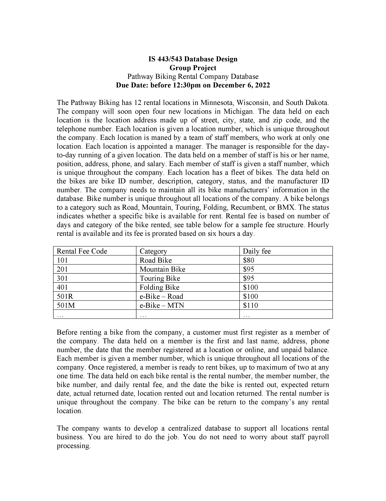
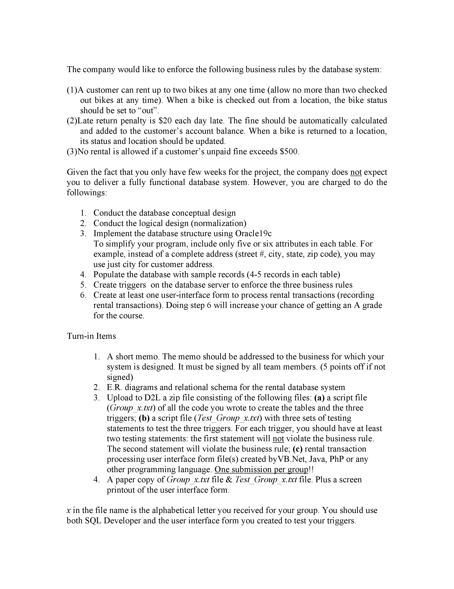
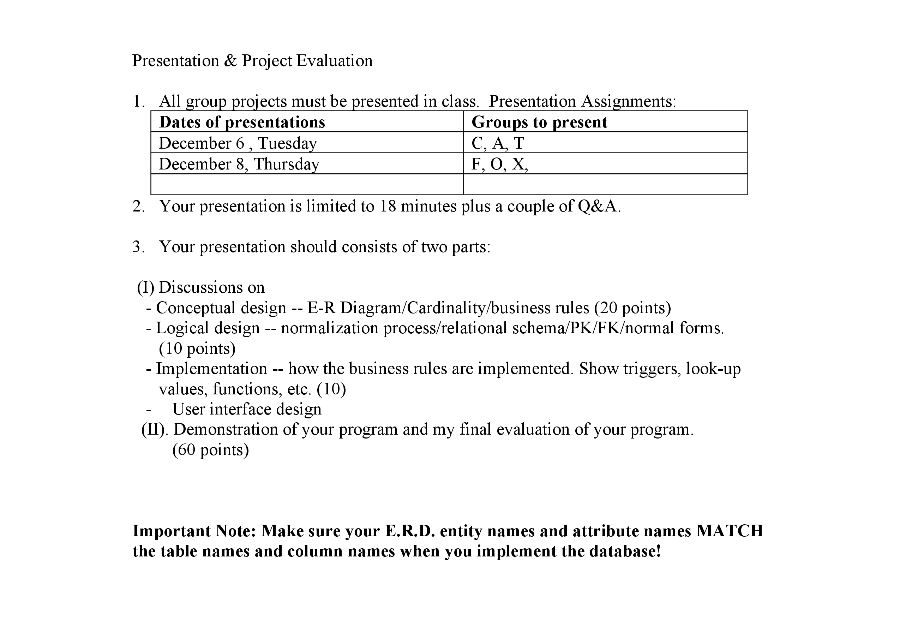

Group Project: Bike Rental Database

<!-- Improved compatibility of back to top link: See: https://github.com/othneildrew/Best-README-Template/pull/73 -->
<a name="readme-top"></a>
<!--
*** Thanks for checking out the Best-README-Template. If you have a suggestion
*** that would make this better, please fork the repo and create a pull request
*** or simply open an issue with the tag "enhancement".
*** Don't forget to give the project a star!
*** Thanks again! Now go create something AMAZING! :D
-->


<!-- PROJECT SHIELDS -->
<!--
*** I'm using markdown "reference style" links for readability.
*** Reference links are enclosed in brackets [ ] instead of parentheses ( ).
*** See the bottom of this document for the declaration of the reference variables
*** for contributors-url, forks-url, etc. This is an optional, concise syntax you may use.
*** https://www.markdownguide.org/basic-syntax/#reference-style-links
-->


<!-- PROJECT LOGO -->

<div align="center">

[](https://www.python.org/)

</div>

<!-- GETTING STARTED -->
## Getting Started
To get a local copy up and running follow these steps.

### Prerequisites

* Oracle Instant Client
  <p><a href="https://www.oracle.com/mx/database/technologies/instant-client/winx64-64-downloads.html">https://www.oracle.com/mx/database/technologies/instant-client/winx64-64-downloads.html</a></p>
  
* A working Git installation
  <p><a href="https://github.com/git-guides/install-git">https://github.com/git-guides/install-git</a></p>

* Access to an Oracle database, as well as SQL developer

* An editor of your choice such as VS code

* Install Python if you don't have it (I used 3.8-3.10 for this project)
  <p><a href="https://realpython.com/installing-python/">https://realpython.com/installing-python/</a></p>

### Installation

1. Create a project folder

2.  Clone the repo
   ```sh
   cd your-project-folder 
   git clone https://github.com/mcworkaholic/IS443-Bike-Database.git
   ```

3.  Change credentials in "sample.env" to reflect those for your database connection and rename the file to ".env" 

4.  Change the path to your oracle instant client in __init__.py

5.  run script.sql in SQL developer to create the database

6.  If still in "your-project-folder" via terminal, type (make sure to change the path):
   
    ```sh
    pip install -r path/to/requirements.txt --upgrade
    ```

7.  Run main.py via terminal or your editor and navigate to your/ip/login to test the required business rules

    ```sh
    python main.py
    ```


### Assignment Prompt








<!-- CONTRIBUTING -->
## Contributing

Contributions are what make the open source community such an amazing place to learn, inspire, and create. Any contributions you make are **greatly appreciated**.

If you have a suggestion that would make this better, please fork the repo and create a pull request. You can also simply open an issue with the tag "enhancement".
Don't forget to give the project a star! Thanks again!

1. Fork the Project
2. Create your Feature Branch (`git checkout -b feature/AmazingFeature`)
3. Commit your Changes (`git commit -m 'Add some AmazingFeature'`)
4. Push to the Branch (`git push origin feature/AmazingFeature`)
5. Open a Pull Request


<!-- ACKNOWLEDGMENTS -->
## Acknowledgments

* [https://github.com/othneildrew/Best-README-Template](https://github.com/othneildrew/Best-README-Template)

<p align="right">(<a href="#readme-top">back to top</a>)</p>

<!-- MARKDOWN LINKS & IMAGES -->
<!-- https://www.markdownguide.org/basic-syntax/#reference-style-links -->
[contributors-shield]: https://img.shields.io/github/contributors/mcworkaholic/IS443-Bike-Database.svg?style=for-the-badge
[contributors-url]: https://github.com/mcworkaholic/IS443-Bike-Database/graphs/contributors
[forks-shield]: https://img.shields.io/github/forks/mcworkaholic/IS443-Bike-Database.svg?style=for-the-badge
[forks-url]: https://github.com/mcworkaholic/IS443-Bike-Database/network/members
[stars-shield]: https://img.shields.io/github/stars/mcworkaholic/IS443-Bike-Database.svg?style=for-the-badge
[stars-url]: https://github.com/mcworkaholic/IS443-Bike-Database/stargazers
[issues-shield]: https://img.shields.io/github/issues/mcworkaholic/IS443-Bike-Database.svg?style=for-the-badge
[issues-url]: https://github.com/mcworkaholic/IS443-Bike-Database/issues
[license-shield]: https://img.shields.io/github/license/mcworkaholic/IS443-Bike-Database.svg?style=for-the-badge
[license-url]: https://github.com/mcworkaholic/IS443-Bike-Database/blob/master/LICENSE.txt
[linkedin-shield]: https://img.shields.io/badge/-LinkedIn-black.svg?style=for-the-badge&logo=linkedin&colorB=555
[linkedin-url]: https://linkedin.com/in/weston-evans
[product-screenshot]: images/screenshot.png
